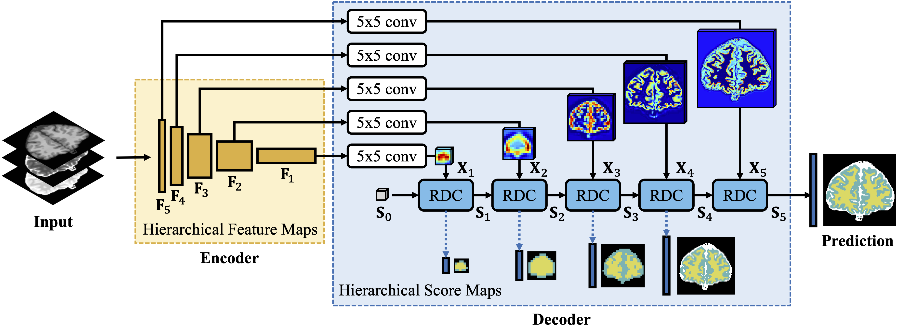

# Recurrent Decoding Cell
This is the PyTorch implementation for **AAAI 2020** paper [Segmenting Medical MRI via Recurrent Decoding Cell](https://arxiv.org/abs/1911.09401) by Ying Wen, Kai Xie, Lianghua He.



### Overview
[Recurrent Decoding Cell](https://github.com/shakex/Recurrent-Decoding-Cell) (RDC) is a novel feature fusion unit used in the encoder-decoder segmentation network for MRI segmentation. RDC leverages convolutional RNNs (e.g. [ConvLSTM](https://arxiv.org/abs/1506.04214), [ConvGRU](https://arxiv.org/abs/1706.03458)) to memorize the long-term context information from the previous layers in the decoding phase. The RDC based encoder-decoder network named Convolutional Recurrent Decoding Network (CRDN) achieves promising semgmentation reuslts -- **99.34% dice score on BrainWeb, 91.26% dice score on MRBrainS, and 88.13% dice score on HVSMR**. The model is also robust to image noise and intensity non-uniformity in medical MRI.

### Models Icluded
* [FCN](https://arxiv.org/abs/1411.4038)
* [SegNet](https://arxiv.org/abs/1511.00561)
* [UNet](https://arxiv.org/abs/1505.04597)
* [CRDN (Ours)](https://arxiv.org/abs/1911.09401) with different encoders
    * CRDN with VGG16 (VGG16RNN)
    * CRDN with ResNet50 (ResNet50RNN/)
    * CRDN with U-Net-backbone (UNetRNN)
* U-Net(decoder) with VGG16(encoder) (VGGUNet)
* U-Net(decoder) with ResNet50(encoder) (ResNet50UNet)
- FCN(decoder) with U-Net-backbone(encoder) (UNetFCN)
- FCN(decoder) with ResNet50(encoder) (ResNet50FCN)
- SegNet(decoder) with U-Net-backbone(encoder) (UNetSegNet)

### Enviroments
* pytorch == 1.1.0
* torchvision == 0.2.2.post3
* matplotlib == 2.1.0
* numpy == 1.11.3
* tqdm == 4.31.1

#### One-line installation
`pip install -r requirements.txt`

### Datasets

* [BrainWeb (Normal Brain Database)](https://brainweb.bic.mni.mcgill.ca/brainweb/selection_normal.html)
* [MRBrainS 2013](https://mrbrains13.isi.uu.nl/)
* [HVSMR 2016](http://segchd.csail.mit.edu/data.html)


### Usage
**Setup config**

```yaml
model:
    arch: <name> [options: 'FCN, SegNet, UNet, VGG16RNN, ResNet50RNN, UNetRNN, VGGUNet, ResNet50UNet, UNetFCN, ResNet50FCN, UNetSegNet']
TinyRNN

data:
    dataset: <name> [options: 'BrainWeb, MRBrainS, HVSMR']
    train_split: train
    val_split: val
    path: <path/to/data>

training:
    gpu_idx: 0
    train_iters: 30000
    batch_size: 1
    val_interval: 300
    n_workers: 4
    print_interval: 100
    optimizer:
        name: <optimizer_name> [options: 'sgd, adam, adamax, asgd, adadelta, adagrad, rmsprop']
        lr: 6.0e-4
        weight_decay: 0.0005
    loss:
        name: 'cross_entropy'
    lr_schedule:
        name: <schedule_type> [options: 'constant_lr, poly_lr, multi_step, cosine_annealing, exp_lr']
        <scheduler_keyarg1>:<value>

    # Resume from checkpoint
    resume: <path_to_checkpoint>
    
    # model save path
    model_dir: <path_to_save_model>

testing:
    # trained model path
    trained_model: <path_to_trained_model>

    # segmentation results save path
    path: <path_to_results>
    
    # if show boxplot results
    boxplot: False
```

**To train the model :**
run `train.py`

**To test the model :**
run `test.py`


### Acknowledgements
Special thanks for the source code of 

### Citation
Please cite these papers in your publications if it helps your research:
```bib
@article{wen2020rdc,
    title={Segmenting Medical MRI via Recurrent Decoding Cell},
    author={Wen, Ying and Xie, Kai and He, Lianghua},
    journal={arXiv, preprint arXiv:1911.09401},
    year={2019}
}
```

For any problems, please contact [kxie_shake@outlook.com](mailto:kxie_shake@outlook.com)
